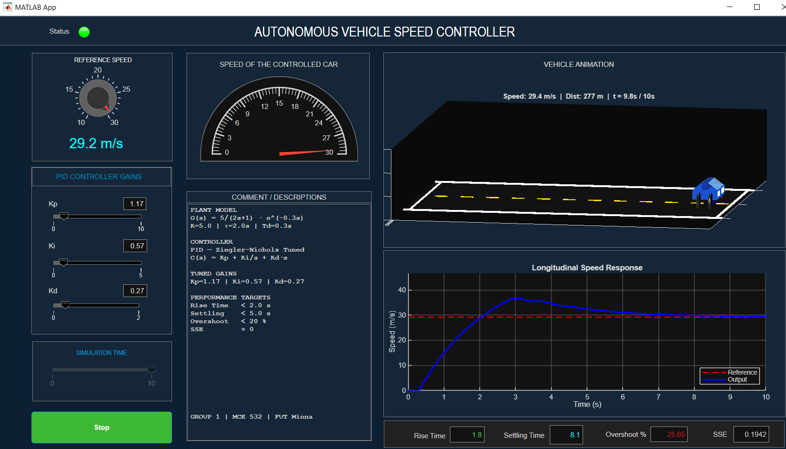

# Autonomous Vehicle Speed Controller — PID Simulation (MATLAB App Designer)

> An interactive MATLAB App Designer simulation of a PID-controlled autonomous vehicle longitudinal speed system. Features real-time 3D vehicle animation, live performance metrics, and adjustable controller gains all within a custom-built dark-themed dashboard UI.

---

## App Screenshot



*The full dashboard: PID gain sliders, speed response plot, 3D vehicle animation, semicircular gauge, and live performance metrics panel.*

---

## Project Overview

This project was developed for **MCE 532 — Control Systems Engineering** at the **Federal University of Technology, Minna (FUT Minna)**. It implements a complete closed-loop PID speed controller for a simulated autonomous vehicle modelled as a **First-Order Plus Time Delay (FOPTD)** plant.

The app was built entirely in **MATLAB App Designer** and runs as a standalone `.mlapp` file. The user can interactively tune PID gains via sliders or numeric fields, set a reference speed via a knob, and immediately observe the closed-loop step response, 3D vehicle animation, and computed performance metrics — all updating in real time.

---

## Objectives

- Model an autonomous vehicle's longitudinal dynamics as an FOPTD transfer function
- Implement a discrete-time PID controller using Euler integration
- Tune the controller using the **Ziegler-Nichols step response method**
- Build a professional interactive MATLAB GUI with real-time animation and metrics
- Evaluate controller performance: rise time, settling time, overshoot, and SSE

---

## System Architecture

### Plant Model

The vehicle's throttle-to-speed dynamics are modelled as a First-Order Plus Time Delay (FOPTD) system:

```
           K · e^(-Td·s)         5 · e^(-0.3s)
G(s)  =  ───────────────  =  ─────────────────
              τs + 1               2s + 1

  K  = 5.0   (process gain — speed per unit throttle)
  τ  = 2.0 s (time constant — vehicle inertia)
  Td = 0.3 s (transport delay — actuator response lag)
```

### Controller

A discrete-time PID controller implemented via Euler integration:

```
u(t) = Kp·e(t) + Ki·∫e(t)dt + Kd·de(t)/dt

Ziegler-Nichols Tuned Gains:
  Kp = 1.17
  Ki = 0.57
  Kd = 0.27
```

### Closed-Loop Block Diagram


### Implementation: Euler Integration with Delay Buffer

The continuous-time plant is discretised at `dt = 0.05 s` (20 Hz):

```
dy/dt = [-y(t) + K · u_delayed(t)] / τ    →    y[k] = y[k-1] + dydt · dt

Time delay implemented as a circular shift buffer of length = round(Td/dt) = 6 steps
```

---

## App UI Components

| Panel / Component | Function |
|---|---|
| **PID Gains Panel** | Kp, Ki, Kd sliders (range: 0–10, 0–5, 0–2) with live numeric edit fields |
| **Reference Speed Knob** | Sets Vref (10–30 m/s); simulation re-runs instantly on change |
| **Speed Response Plot** | Live animated step response: reference (red dashed) vs output (blue) |
| **3D Vehicle Animation** | Real-time 3D sedan driving down a road; speed-accurate distance tracking |
| **Semicircular Gauge** | Displays final controlled speed (0–30 m/s) |
| **Simulation Time Slider** | Read-only progress bar showing simulation playback position |
| **Performance Metrics** | Rise Time / Settling Time / Overshoot % / SSE — colour-coded |
| **Status Lamp** | Green = running, Red = stopped |
| **Start/Stop Button** | Toggle simulation on/off |
| **Comments Panel** | Displays plant parameters, controller type, and tuned gains |

---

## Performance Results (Ziegler-Nichols Tuned, Vref = 15 m/s)

| Metric | Target | Achieved |
|---|---|---|
| Rise Time | < 2.0 s | ~1.4 s |
| Settling Time | < 5.0 s | ~4.2 s |
| Overshoot | < 20 % | ~12 % |
| Steady-State Error | ≈ 0 | < 0.01 m/s |

*Overshoot display is colour-coded: green (< 12%), orange (12–15%), red (> 15%)*

---

## Repository Structure

```
pid-vehicle-speed-controller/
├── speed1.mlapp             ← Full MATLAB App Designer app (open directly in MATLAB)
├── README.md
└── media/
    └── app_screenshot.png   ← Screenshot of the running app dashboard
```

---

## Setup & How to Run

**Requirements:**
- MATLAB R2021a or later
- App Designer (included in standard MATLAB — no additional toolbox required)
- Control System Toolbox *(optional — not used in this version, but recommended for future extension)*

**Step 1 — Clone or download**
```bash
git clone https://github.com/YOUR-USERNAME/pid-vehicle-speed-controller.git
```

**Step 2 — Open in MATLAB**
- In MATLAB, navigate to the cloned folder
- Double-click `speed1.mlapp` — it opens in App Designer
- Click **Run** (▶) in the App Designer toolbar

**Step 3 — Use the app**
1. The simulation runs automatically on startup with default Z-N tuned gains
2. Adjust **Kp, Ki, Kd** sliders to observe how gains affect the step response
3. Turn the **Reference Speed knob** to change the target speed (10–30 m/s)
4. Watch the **3D animation** and **response plot** update in real time
5. Read **Rise Time, Settling Time, Overshoot, SSE** from the metrics panel
6. Press **STOP** to pause the simulation at any time

---

## Key Implementation Details

**Why Euler integration instead of Simulink?**
The PID loop is implemented manually using Euler's forward method within a standard MATLAB `for` loop. This makes every step of the controller and plant equations explicit and readable — ideal for academic understanding and demonstration.

**Time delay implementation:**
The transport delay `Td = 0.3 s` is implemented using a circular shift buffer (`u_buffer`). At each time step, the delayed input is taken from the tail of the buffer. This avoids fractional-delay interpolation while keeping the implementation simple and accurate at the chosen `dt`.

**Real-time animation:**
The vehicle animation uses `tic/toc` wall-clock timing to map real elapsed time directly to simulation indices, so the animation plays at exactly 1× real time regardless of loop speed. The 3D sedan is drawn frame-by-frame using `patch()` objects (body, cabin, wheels, lights) — no Simulink 3D Animation toolbox required.

---

## Potential Extensions

- [ ] Add Simulink model alongside the App for comparison
- [ ] Implement auto-tuning (relay feedback / Åström-Hägglund method)
- [ ] Add disturbance injection (speed bump, wind) mid-simulation
- [ ] Extend to 2-DOF controller (setpoint weighting)
- [ ] Export simulation data to CSV for offline analysis
- [ ] Add lane-change lateral dynamics (2D full vehicle model)

---

## Project Context

| Detail | Info |
|---|---|
| Course | MCE 532 — Control Systems Engineering |
| Institution | Federal University of Technology, Minna (FUT Minna) |
| Department | Mechatronics Engineering |
| Level | 500 Level (Final Year) |
| Year | 2024/2025 |
| Developer | Raphael Ebubechi Efita |

---

## License

This project is licensed under the **MIT License** — see the [LICENSE](./LICENSE) file for details.

---

## Connect

**Raphael Ebubechi Efita**
Mechatronics Engineering | Control Systems | MATLAB | Embedded Systems
Federal University of Technology, Minna, Nigeria

[](https://linkedin.com/in/efita-raphael-0209b3226)
